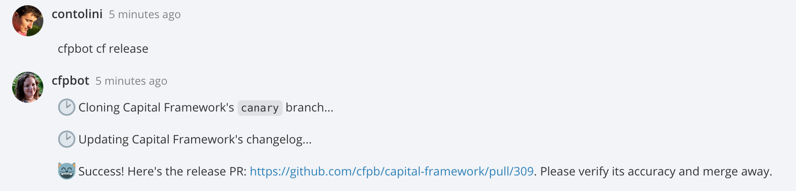

# hubot-capital-framework [](https://travis-ci.org/cfpb/hubot-capital-framework) [](https://www.npmjs.com/package/hubot-capital-framework)

A Hubot script to manage CFPB's [Capital Framework](https://github.com/cfpb/capital-framework).

See [`src/capital-framework.coffee`](src/capital-framework.coffee) for full documentation.



## Installation

In hubot project repo, run:

`npm install hubot-capital-framework --save`

Then add **hubot-capital-framework** to your `external-scripts.json`:

```json
["hubot-capital-framework"]
```

## Sample Interaction

```
user1>> cf release
hubot>> 😸 Success! Here's the release PR: https://github.com/cfpb/capital-framework/pull/123. Please verify its accuracy and merge away.
```

## Contributing

Please read our general [contributing guidelines](CONTRIBUTING.md).

## Open source licensing info
1. [TERMS](TERMS.md)
2. [LICENSE](LICENSE)
3. [CFPB Source Code Policy](https://github.com/cfpb/source-code-policy/)
